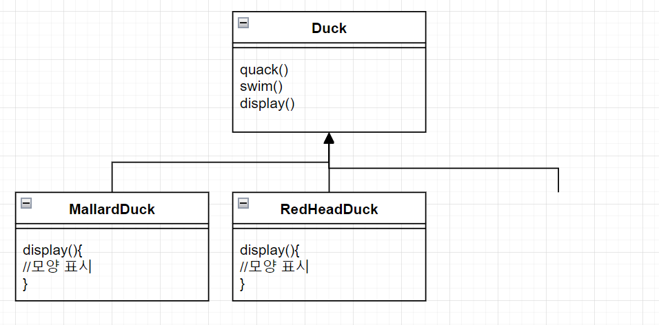
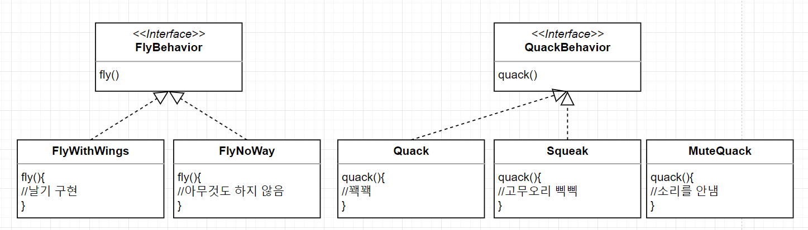
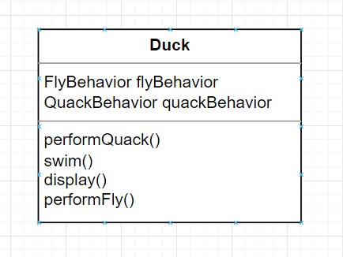

# (1장) 디자인 패턴 소개와 전략 패턴

## 오리 시뮬레이션 게임
* 오리 시뮬레이션 게임에서, 매우 다양한 오리들이 존재하며 아래와 같은 행동을 할 수 있다
  1. 꽥꽥거리기
  2. 수영하기
  3. 화면에 표시
  

* 해당 행동 구현을 위해 상속을 통해 Duck 이라는 슈퍼 클래스를 만든 다음, 각각의 오리 자식들마다 상속을 통해 오리들을 구현하도록 설계되었다

  


* 이제 다른 게임과의 차별성을 위해 오리는 날수 있어야 한다는 요구조건이 추가되었다. 따라서 부모클래스에 아래와 같이 날기 메서드를 추가하였다
  

* 이렇게 구현되면 문제점은 무엇일까?
  1. 모든 오리 클래스가 갑자기 날 수 있게 된다
  2. 날지 못하는 오리 클래스들이 fly() 메서드를 오버라이드 하여 날지 않도록 일일히 구현해야 한다

* 이와 비슷하게 상속을 통해 구현하면 아래와 같은 단점이 될 수 있는 요소들이 존재한다
  1. 서브클래스에서 코드가 중복된다(불필요한 override 가 생김)
  2. 실행 시에 특징을 바꾸기 힘들다(super class 에 메서드가 고정되어 있으므로)
  3. 모든 오리의 행동을 알기 힘들다(?)
  4. 코드를 변경했을 때 다른 오리들에게 원치 않는 영향을 끼칠 수 있다(super class 에 메서드가 추가될 경우)

* 그렇다면 꽥꽥거리기, 날기 행동을 아래와 같이 인터페이스를 통해 구현하면 어떻게 될까?
 

* 아래와 같은 문제점이 발생한다
  1. 인터페이스로 묶여있기 떄문에 구현을 재사용할 수 없다. 만약 날기의 구현이 달라진다면, 모든 Flyable 을 구현한 클래스에 가서 다시 일일히 수정해주어야 한다

* 어떤 식으로 변경하여야 할까?
* 변화하는 부분을 찾아내서 따로 뽑아내 캡슐화한다. 오리의 기능에서 달라지는 부분은 날기, 꽥꽥거리기이다
  > 캡슐화 : <br>객체의 속성(data fields)과 행위(메서드, methods)를 하나로 묶고, 실제 구현 내용 일부를 내부에 감추어 은닉한다

* 날기, 꽥꽥거리기를 별도의 클래스 집합으로 뽑아내서 인터페이스를 통해 아래와 같이 디자인한다.
  

* 해당과 같이 구현하면, 오리뿐만이 아닌 다른 객체에서도 나는 행동과 꽥꽥거리는 행동을 구현할 수 있다
* 부모 클래스를 수정하지 않고도 특정 행동을 추가할 수 있다.

* Duck 부모 클래스는 아래와 같은 구조를 가지게 되며, 날기,꽥꽥거리기는 다른 클래스에 "위임" 된다
  

* 해당 부분을 실제로 구현한 Duck 클래스는 아래와 같다
  ```java
  public abstract class Duck {
      FlyBehavior flyBehavior;
      QuackBehavior quackBehavior;
  
      public Duck() {
      }
  
      public void setFlyBehavior(FlyBehavior fb) {
          flyBehavior = fb;
      }
  
      public void setQuackBehavior(QuackBehavior qb) {
          quackBehavior = qb;
      }
  
      abstract void display();
  
      public void performFly() {
          flyBehavior.fly();
      }
  
      public void performQuack() {
          quackBehavior.quack();
      }
  
      public void swim() {
          System.out.println("모든 오리는 물에 뜹니. 가짜 오리도 뜨죠");
      }
  }
  
  ```

  * setFlyBehavior, setQuackBehavior 는 실행 시에도 행동을 바꿀 수 있게 하기 위해 추가된 메서드이다
  * 
* 각 오리에는 날기, 꽥꽥거리기가 있으며 이를 다른 클래스에 위임받고 있다. 이런식으로 각 클래스를 합쳐서 사용하는 것을 구성(composition) 을 이용한다고 부른다. 상속보다는 구성을 활용하는 것이 일반적으로 좋다
* 오리 클래스의 행동을 구현하는데 사용한 디자인 패턴을 전략 패턴(StrategyPattern) 이라 한다
* 전략 패턴은, 알고리즘군을 정의하고 캡슐화해서 각각의 알고리즘군을 수정해서 쓸 수 있게 해준다. 전략패턴을 사용하면 클라이언트로부터 알고리즘을 분리해서 독립적으로 사용할 수 있게 해준다

