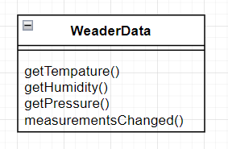
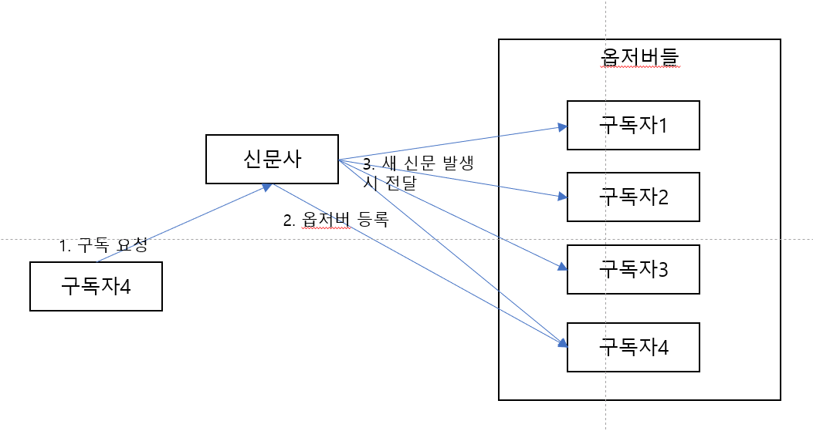
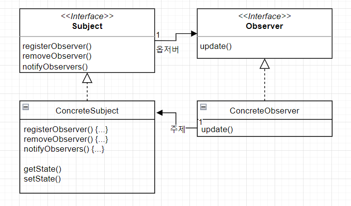
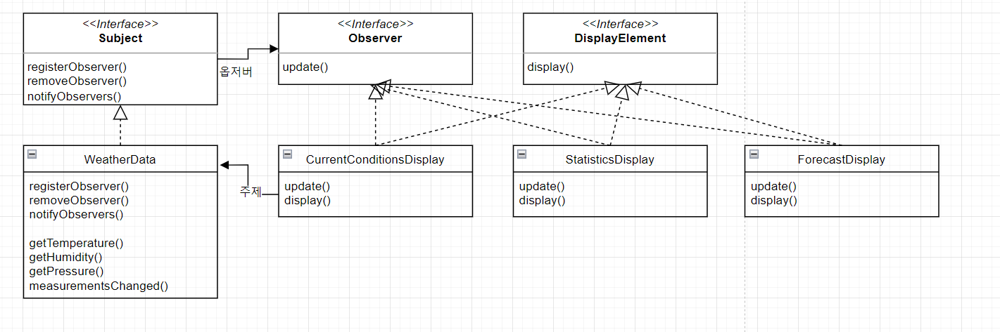

# (2장) 객체들에게 연락 돌리기 - 옵저버 패턴

## 기상 모니터링 애플리케이션
* Weather-O-Rama 에서 제공해주는 기상관측 데이터를 이용하여, 아래와 같은 애플리케이션을 만들어야 한다
* 기상관측 데이터를 보내주는 클래스는 아래와 같다

    

* 기상관측 데이터가 바뀔 때마다 아래 메서드가 실행된다
  ~~~java
    /*기상관측 데이터가 갱신될때마다 호출*/
    public void measurementsChanged(){
        //호출
    } 
  ~~~

* 이 데이터가 호출될때마다 디스플레이에 기상관측 데이터를 바꾸는 로직이 들어가야 한다. 다만 확장성 및 변경에 유연하게 설계되어야 한다. (새로운 디스플레이 추가)
* 아래와 같이 온도, 습도, 기압을 이용해서 각 디스플레이 클래스를 업데이트 하는 로직을 구현하면 어떨까?
  ~~~java
    public class WeatherData {
    public void measurementsChanged(){
        
        float temp = getTemperature();
        float humidity = gethumidity();
        float pressure = getPressure();
        
        currentConditionsDisplay.update(temp, humidity, pressure);
        statisticsDisplay.update(temp, humidity, pressure);
        forecastDisplay.update(temp, humidity, pressure);
    }
  }
  ~~~
  
* 위의 코드는 문제가 다음과 같은 문제가 있다.
  1. 인터페이스가 아닌 구체적인 구현을 바탕으로 코딩하고 있다
     * 각각의 디스플레이 클래스의 실제 구현체를 호출하여 코딩하고 있음
     * 디스플레이 항목과 데이터를 주고받는 데 공통된 인터페이스를 사용하고 있다고 설명하는데, 구체적인 구현을 바탕으로 코딩하고 있는 것은 어떤 뜻인지?
  2. 새로운 디스플레이 항목이 추가될 때마다 코드를 변경해야 함
     * 강수량 데이터 및 디스플레이가 추가되었을 때 코드가 변경되어야 한다
  3. 실행중에 디스플레이 항목을 추가하거나 제거할 수 없음
  4. 바뀌는 부분을 캡슐화하지 않았음
     * 변경될 수 있는 부분 : 측정값들, 디스플레이들
* 이를 해결하기 위해 옵저버 패턴을 이용한다

## 옵저버 패턴
* 옵저버 패턴은, 신문자와 구독자의 관계를 생각하면 된다. 바뀌는 대상을 주제(subject) 라고 하며 바뀐 부분을 호출받는 대상을 옵저버(observer) 라한다 신문사가 주제(subject), 구독자는 옵저버(observer) 이다
  
    
* 옵저버 패턴의 정의
  * 옵저버 패턴은 한 객체의 상태가 바뀌면 그 객체에 의존하는 다른 객체에게 연락이 가고 자동으로 내용이 갱신되는 방식으로 일대다 의존성을 정의한다
  * 옵저버 패턴은 여러가지 방법으로 구현할 수 있음. 보통은 주제 인터페이스와 옵저버 인터페이스가 들어있는 클래스 디자인으로 아래와 같이 구현한다
  
  
* 느슨한 결합
  * 느슨한 결합은 객체들이 상호작용할 수는 있지만, 서로를 잘 모르는 관계를 의미한다
  * 옵저버 패턴의 예
    1. 주제는 옵저버가 특정 인터페이스를 구현한다는 사실만 알고 있다
    2. Observer 인터페이스만 구현하면 옵저버는 언제든지 새로 추가할 수 있다
    3. 새로운 옵저버 추가시, 주제를 변경할 필요가 없음
    4. 주제, 옵저버는 서로 독립적으로 재사용할 수 있음
    5. 주제나 옵저버가 달라져도 서로에게 영향을 미치지 않음

* 옵저버 패턴을 이용해서, 기상 모니터링 디스플레이를 설계하면 아래와 같다
  

* 해당 설계를 이용해서 주제인 WeatherData 인터페이스를 구현하면 아래와 같다
  ~~~java
  public class WeatherData implements Subject {
      private List<Observer> observers;
      private float temperature;
      private float humidity;
      private float pressure;
      
      public WeatherData() {
          observers = new ArrayList<Observer>();
      }
      
      public void registerObserver(Observer o) {
          observers.add(o);
      }
      
      public void removeObserver(Observer o) {
          observers.remove(o);
      }
      
      public void notifyObservers() {
          for (Observer observer : observers) {
              observer.update(temperature, humidity, pressure);
          }
      }
      
      public void measurementsChanged() {
          notifyObservers();
      }
      
      public void setMeasurements(float temperature, float humidity, float pressure) {
          this.temperature = temperature;
          this.humidity = humidity;
          this.pressure = pressure;
          measurementsChanged();
      }
  
      public float getTemperature() {
          return temperature;
      }
      
      public float getHumidity() {
          return humidity;
      }
      
      public float getPressure() {
          return pressure;
      }
  
  }
  ~~~
  
* 옵저버인 CurrentConditionsDisplay 를 구현하면 아래와 같다
  ~~~java
  public class CurrentConditionsDisplay implements Observer, DisplayElement {
    private float temperature;
    private float humidity;
    private WeatherData weatherData;
  
    public CurrentConditionsDisplay(WeatherData weatherData) {
      this.weatherData = weatherData;
      weatherData.registerObserver(this);
    }
  
    public void update(float temperature, float humidity, float pressure) {
      this.temperature = temperature;
      this.humidity = humidity;
      display();
    }
  
    public void display() {
      System.out.println("Current conditions: " + temperature
              + "F degrees and " + humidity + "% humidity");
    }
  }
  
  ~~~
  
* 해당 구현들을 사용한 기상 스테이션 애플리케이션의 메인 클래스는 아래와 같다
  ~~~java
  public class WeatherStation {
  
    public static void main(String[] args) {
      WeatherData weatherData = new WeatherData();
  
      CurrentConditionsDisplay currentDisplay =
              new CurrentConditionsDisplay(weatherData);
      StatisticsDisplay statisticsDisplay = new StatisticsDisplay(weatherData);
      ForecastDisplay forecastDisplay = new ForecastDisplay(weatherData);
  
      weatherData.setMeasurements(80, 65, 30.4f);
      weatherData.setMeasurements(82, 70, 29.2f);
      weatherData.setMeasurements(78, 90, 29.2f);
  
      weatherData.removeObserver(forecastDisplay);
      weatherData.setMeasurements(62, 90, 28.1f);
    }
  }  
  ~~~

* 자바에는 이미 기존에 Observable(주제) 클래스와 Observer(옵저버) 인터페이스가 있었다. 하지만 자바 9 이후로는 쓰이지 않는다. 사람들이 자신의 코드로 구현하는것이 낫다고 생각되면서 없어지게 되었다
* 옵저버 패턴에는 데이터를 변경하는 두가지 방식이 있다. push 와 pull 방식이다. 이 부분은 어떤 방식을 사용해도 상관없다
  * push 방식 : 데이터를 주제 클래스에서 보내주는 방식
  * pull 방식 : 옵저버가 데이터를 주제 클래스에서 꺼내오는 방식
* 아래 코드와 같이 pull 방식으로 간단하게 변경할 수 있다.
~~~java
  public void notifyObservers(){
    for(Observer observer : observers){
        observer.update();    
    }  
  }

  public interface Observer(){
    public void update();
  }
  
  public void update(){
     this.temperature = weatherData.getTemperature();
     this.humidity = weatherData.getHumidity();
     display();
    }
  }
~~~

