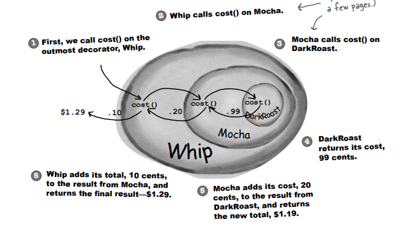

# (3장) 객체 꾸미기 - 데코레이터 패턴

## 커피 전문점, 스타버즈
* 스타버즈라는 커피숍에서, 아래와 같은 주문 시스템 클래스를 통해 사업을 하고 있다

* 우유, 두유, 휘핑크림등의 첨가물을 얹어야 할 경우 각각의 클래스를 만들어 해결하다 보니, 아래와 같이 클래스가 다수 생성되게 되었다

* 이런 문제를 해결하기 위해, 첨가물들을 슈퍼클래스의 인스턴스 변수로 아래와 같이 변경하였다

* 첨가물을 인스턴스화하여 한 구현으로 나름 많이 깔끔해졌는데, 어떤 부분이 문제일까?
* 문제점
  * 첨가물 가격이 바뀔 때마다 기존 코드를 수정해야 한다
  * 첨가물의 종류가 많아지면 새로운 메서드 추가 및, 슈퍼클래스의 cost() 메서드를 수정해야 한다
  * 특정 첨가물이 들어가면 안되는 클래스도 첨가물의 인스턴스를 가지게 됨
  * 첨가물을 두개 주문하는 것을 고려하지 않음

* 데코레이터 패턴은, 위와 같은 상황에서 첨가물로 음료를 '장식' 할 수 있도록 해준다


## 데코레이터 패턴의 정의
> 데코레이터 패턴으로 객체에 추가 요소를 동적으로 더할 수 있으며, 서브클래스를 만들 때보다 훨씬 유연하게 기능을 확장할 수 있다
* 패턴의 클래스 다이어그램

  

* 데코레이터 패턴을 이용해서, 커피에 적용시키면 아래와 같다
  

* 각 첨가물들은 음료 클래스를 내부 필드로 가지고 있으며, CondimentDecorator 추상 클래스는, Beverage 를 상속하고 있다(첨가물 클래스가 Beverage 여야 하므로)
* Beverage class
  ```java
  public abstract class Beverage {
      String description = "제목 없음";
    
      public String getDescription() {
          return description;
      }
   
      public abstract double cost();
  }
  ```
* CondimentDecorator class
  ```java
  public abstract class CondimentDecorator extends Beverage {
      Beverage beverage;
      public abstract String getDescription();
  }
  ```
* Espresso class
  ```java
  public class Espresso extends Beverage {
    
      public Espresso() {
          description = "에스프레소";
      }
    
      public double cost() {
          return 1.99;
      }
  }
  ```
* Mocha class
  ```java
  public class Mocha extends CondimentDecorator {
      public Mocha(Beverage beverage) {
          this.beverage = beverage;
      }
   
      public String getDescription() {
          return beverage.getDescription() + ", 모카";
      }
   
      public double cost() {
          return .20 + beverage.cost();
      }
  }
  ```
* StarBuzzCoffee class
  ```java
  public class StarbuzzCoffee {
   
      public static void main(String args[]) {
          Beverage beverage = new Espresso();
          System.out.println(beverage.getDescription() 
                  + " $" + beverage.cost());
   
          Beverage beverage2 = new DarkRoast();
          beverage2 = new Mocha(beverage2);
          beverage2 = new Mocha(beverage2);
          beverage2 = new Whip(beverage2);
          System.out.println(beverage2.getDescription() 
                  + " $" + beverage2.cost());
   
      }
  }
  
  실행결과
  
  에스프레소 $1.99
  다크 로스트 커피, 모카, 모카, 휘핑크림 $1.49
  ```
  
* 데코레이터 패턴의 조심해야 할 점
  * 데코레이터로 감싸면, 원래 어떤 커피였는지 알기가 힘들어진다. 만약 다크블렌드 커피만 특별 할인이 들어간다면? 이럴 경우에는 데코레이터 패턴을 지양하여야 한다
  * 감싸는 순서가 강제되지 않으므로.. 순서가 중요하다면 주의해서 감싸야 한다
