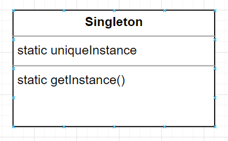

# 디자인 패턴 스터디(싱글턴 패턴)

# 싱글턴 패턴의 정의

> 클래스 인스턴스를 하나만 만들고, 그 인스턴스로의 전역 접근을 제공한다
> 

### 고전적인 싱글턴 패턴 구현법

```java
public class Singleton {
	private static Singleton uniqueInstance;
 
	private Singleton() {}
 
	public static Singleton getInstance() {
		if (uniqueInstance == null) {
			uniqueInstance = new Singleton();
		}
		return uniqueInstance;
	}
}
```

- 생성자를 private 처리하여, 외부에서 new 로 객체생성을 막는다

### 싱글턴 패턴의 이점

1. 설정 객체등, 하나만 존재해야 하는 인스턴스에 대한 구현 방법 제공
2. 전역 변수로 선언하는것과 다르게, 실제 사용할 때만 객체를 생성할 수 있음
3. 전역으로 접근 방법을 제공하므로, 파라미터 없이 다른 클래스에서 자원에 대한 접근이 가능

### 초콜릿 보일러 코드의 문제점?

```java
public class ChocolateBoiler {
	private boolean empty;
	private boolean boiled;
	
	private ChocolateBoiler() {
		empty = true;
		boiled = false;
	}
  
	public void fill() {
		if (isEmpty()) {
			empty = false;
			boiled = false;
			// 보일러에 우유와 초콜릿을 혼합한 재료를 넣음
		}
	}
 
	public void drain() {
		if (!isEmpty() && isBoiled()) {
			// 끓인 재료를 다음 단계로 넘김
			empty = true;
		}
	}
 
	public void boil() {
		if (!isEmpty() && !isBoiled()) {
			// 재료를 끓임
			boiled = true;
		}
	}
  
	public boolean isEmpty() {
		return empty;
	}
 
	public boolean isBoiled() {
		return boiled;
	}
}
```

- 인스턴스가 두개 이상 생길 경우, fill → boil → drain 로직이 엉뚱하게 호출될 수 있다

### 클래스 다이어그램



- 정적 변수에 인스턴스 저장, 정적 메서드로 인스턴스에 대한 접근 허용

### 고전적인 싱글턴 방식의 멀티스레딩 문제

- 고전 방식의 싱글턴은, 멀티스레드 어플리케이션 내에서 두개 이상의 인스턴스를 생성할 수 있으므로 아래와 같이 synchronized 를 통해 동시 접근을 막는다

```java
public class Singleton {
	private static Singleton uniqueInstance;
 
	private Singleton() {}
 
	public **static** synchronized Singleton getInstance() {
		if (uniqueInstance == null) {
			uniqueInstance = new Singleton();
		}
		return uniqueInstance;
	}
```

- 메소드를 동기화 하면 약 100배정도 느려진다
- 느려짐을 해결하는 방법
    1. 성능이 중요하지 않은 부분인 경우 그냥 둔다
    2. 싱글톤 인스턴스를 그냥 만들어버린다
    3. DCL(Double-Checked Locking) 을 쓴다
    
    ```java
    private volatile static Singleton uniqueInstance;
     
    	private Singleton() {}
     
    	public static Singleton getInstance() {
    		if (uniqueInstance == null) {
    			synchronized (Singleton.class) {
    				if (uniqueInstance == null) {
    					uniqueInstance = new Singleton();
    				}
    			}
    		}
    		return uniqueInstance;
    	}
    ```
    
- volatile 을 왜 쓸까?, DCL 에서 volatile 을 쓰지 않았을 경우 두개의 인스턴스가 만들어질 수 있음
- [https://junghyungil.tistory.com/150](https://junghyungil.tistory.com/150)

### 직렬화/역직렬화, 리플렉션

- 싱글턴은 이제 완벽한가?, 직렬화/역직렬화 리플렉션 등을 통해 여러 인스턴스가 만들어 질 수 있음
- [https://scshim.tistory.com/361](https://scshim.tistory.com/361)

### Enum 을 통한, 싱글턴 생성

- Enum 을 통해서도, 싱글턴을 구현할 수 있다

```java
public enum Singleton {
	UNIQUE_INSTANCE;

}
```

- 직렬화/역직렬화 리플렉션에 안전한데..
- 해당과 같이 쓰는 부분은 아직 보지 못하였음

## 제가 경험한 싱글턴의 장/단점

- 장점
    - 접근하기 편하다(안좋은면 일수도)
- 단점
    - 설정을 싱글턴으로 사용하고 있음, 작은 부분 테스트 시에도 해당 부분이 싱글턴 객체를 참조하고 있다면, 세팅을 로딩해줘야 하는 경우가 있음
    - 설정 변경시, 굉장히 많은 클래스를 수정하여야 하는 부분
    

##