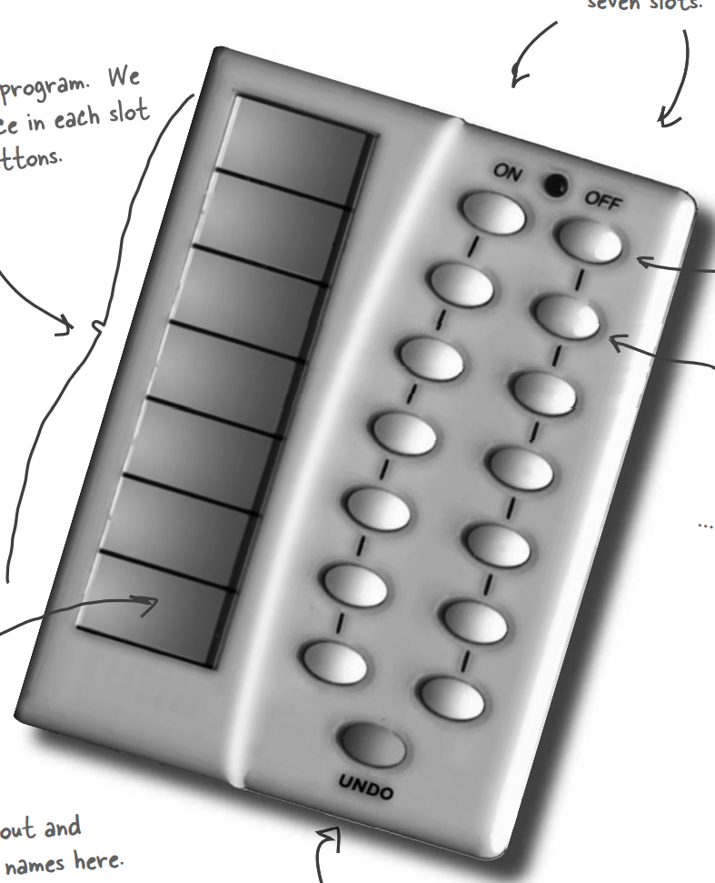

# 디자인 패턴 스터디(커맨드 패턴)

# 커맨드 패턴의 정의

> 커맨드 패턴을 사용하면 요청 내역을 객체로 캡슐화해서 객체를 서로 다른 요청 내역에 따라 매개변수화할 수 있다. 이러면 요청을 큐에 저장하거나 로그로 기록하거나 작업 취소 기능을 사용할 수 있다
> 

## 만능 IOT 리모컨

- 우리는 아래와 같은 만능 IOT 리모컨을 만들어야 합니다



- 요구사항
    - 왼쪽 슬롯에는 원하는 협력업체 제품을 연결/해제 할 수 있다
    - 오른쪽 버튼은 on/off 가 있으며 왼쪽에 연결된 제품에 대한 버튼이다
    - 아래의 UNDO 버튼을 통해 이전에 실행한 명령을 취소할 수 있다

- 근데 아래 협력업체 제품들이 ON/OFF 만 지원하는 것이 아니다(공통적인 인터페이스가 없다)


- 공통된 인터페이스가 없고, 리모콘은 버튼이 두개뿐인데 어떻게 디자인할까?
- 커맨드 패턴을 쓰면 ON/OFF 버튼에 대한 협력업체 제품의 동작을 구성하고, 버튼에 매핑시킬 수 있다

## 식당 주문 로직

- 우선 아래와 같이 식당의 주문 로직을 생각해보면, 손님, 종업원, 요리사는 “주문서” 를 매개체로 소통한다.


- 손님은 어떤 요리를 요청할지, 어떤 요리사가 요리할지를 알고 있고, 그것을 주문서로 표현한다
- 종업원은 아무것도 몰라도 되고 주문서만 주방에 가져다 주면 된다
- 해당 요리사는 주문서를 통해 요리를 만든다
- 해당 식당의 구성요소와 IOT 리모컨을 매칭시켜보면 아래와 같다
    - 손님 : 협력사 OR 개발자(ON, OFF 시 행동 정의)
    - 종업원 : 리모컨
    - 요리사 : 협력업체 제품

- 식당과 유사하게 실제 커맨드 패턴을 나타내면 아래와 같다


## 간단한 커맨드 패턴 구현

- 위의 그림을 참고해서 전구를 켜는 행동을 가지고, 간단하게 커맨드 패턴을 구현하면 아래와 같습니다

```java
public interface Command {
   public void execute();
}
```

```java
public class LightOnCommand implements Command {
   Light light;

   public LightOnCommand(Light light) {
      this.light = light;
   }

   public void execute() {
      light.on();
   }
}
```

```java
public class SimpleRemoteControl {
   Command slot;

   public SimpleRemoteControl() {}

   public void setCommand(Command command) {
      slot = command;
   }

   public void buttonWasPressed() {
      slot.execute();
   }
}
```

- 간단하게 테스트를 구현하면 아래와 같습니다

```java
public class RemoteControlTest {
    public static void main(String[] args) {
        SimpleRemoteControl remoteControl = new SimpleRemoteControl();
        Light light = new Light();
        LightOnCommand lightOnCommand = new LightOnCommand(light);

        remoteControl.setCommand(lightOnCommand);
        remoteControl.buttonWasPressed();
    }
}
```

## 커맨드 패턴 클래스 다이어그램

- 커맨드 패턴의 클래스 다이어그램은 아래와 같습니다


- Client : 리시버 정보와 해야할 행동인 커맨드를 생성
- Invoker : Command 를 실행
- Receiver : 작업을 수행할 대상

## 리모컨 구현하기


- 위의 설계를 바탕으로 리모컨 클래스를 구현하면 아래와 같습니다

```java
public class RemoteControl {
	Command[] onCommands;
	Command[] offCommands;
	Command undoCommand;
 
	public RemoteControl() {
		onCommands = new Command[7];
		offCommands = new Command[7];
 
		Command noCommand = new NoCommand();
		for(int i=0;i<7;i++) {
			onCommands[i] = noCommand;
			offCommands[i] = noCommand;
		}
		undoCommand = noCommand;
	}
  
	public void setCommand(int slot, Command onCommand, Command offCommand) {
		onCommands[slot] = onCommand;
		offCommands[slot] = offCommand;
	}
 
	public void onButtonWasPushed(int slot) {
		onCommands[slot].execute();
		undoCommand = onCommands[slot];
	}
 
	public void offButtonWasPushed(int slot) {
		offCommands[slot].execute();
		undoCommand = offCommands[slot];
	}

	public void undoButtonWasPushed() {
		undoCommand.undo();
	}
 
	public String toString() {
		StringBuffer stringBuff = new StringBuffer();
		stringBuff.append("\n------ 리모컨 -------\n");
		for (int i = 0; i < onCommands.length; i++) {
			stringBuff.append("[slot " + i + "] " + onCommands[i].getClass().getName()
				+ "    " + offCommands[i].getClass().getName() + "\n");
		}
		stringBuff.append("[undo] " + undoCommand.getClass().getName() + "\n");
		return stringBuff.toString();
	}
}
```

- 각 커맨드 클래스들은 상태값을 통해 동작을 다르게 할 수 있습니다
- 아래와 같이 여러개의 Command 를 모은 매크로 Command 를 만들어 실행할 수도 있습니다

```java
public class MacroCommand implements Command {
   Command[] commands;

   public MacroCommand(Command[] commands) {
      this.commands = commands;
   }

   public void execute() {
      for (int i = 0; i < commands.length; i++) {
         commands[i].execute();
      }
   }

	public void undo() {
      for (int i = commands.length -1; i >= 0; i--) {
         commands[i].undo();
      }
   }
}
```

```java
Command[] commands = new Command[]{commandA, commandB, commandC}

MacroCommand macroCommand = new MacroCommand(commands);
```

## Java Thread Pool

- java 의 Runnable 인터페이스도 Command 패턴을 이용해 구현되어 있습니다

```java
public class JavaThreadPoolTest {
    public static void main(String[] args) {
        ExecutorService invoker = Executors.newFixedThreadPool(2);
        invoker.execute(new TestCommand());
    }

    public static class TestCommand implements Runnable {

        @Override
        public void run() {
            System.out.println("test");
        }
    }
}
```

## Commad 패턴 사용처

- 저희 쪽 Web → Backend Application  무언가 요청 시  Command 패턴으로 되어 있습니다


## 커맨드 패턴의 장/단점

- 장점
    - 작업을 요청하는 객체 ↔ 작업수행 객체가 분리되어 SRP 원칙을 잘 지킴
    - 코드 수정 없이 다양한 커맨드가 추가 가능
- 단점
    - 코드의 복잡도 증가
    - Command 클래스가 많아진다